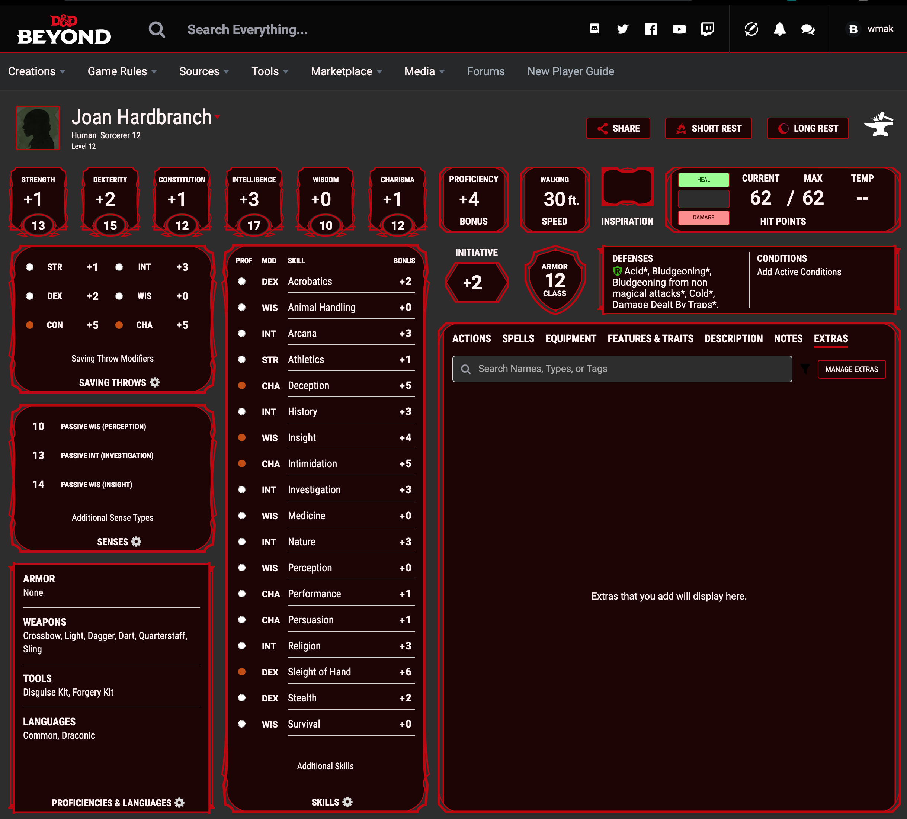

# dndbeyond-darktheme
Custom css theme for dndbeyond Character Sheets

# To Install

1. Install Stylus:
    - [For Chrome](https://chrome.google.com/webstore/detail/stylus/clngdbkpkpeebahjckkjfobafhncgmne?hl=en)
    - [For Firefox](https://addons.mozilla.org/en-US/firefox/addon/styl-us/)
    - [For Opera](https://addons.opera.com/en-gb/extensions/details/stylus/)
2. Open the usercss theme [here](https://github.com/wmak/dndbeyond-darktheme/raw/master/dndbeyond-dark.user.css)

# Adjusting the Theme with Stylus
- Click the Stylus Icon
- Click the gear besides the `DNDBeyond Dark`
- Adjust the colours
    - Please note that colours have to be in RGB
    - (HSV and HEX don't work because of how the variables are being substituted into the SVGs)
    

## Background Url
- This changes the background of the character sheet
- Leave this blank for a plain background

## Base Color
- This changes the background of your character sheet

## Font Color
- This changes the font, but also the colours of some buttons (so that they're visible)

## Secondary Color
- This changes the background of each section

## Border Color
- This changes the border color around each section

## Highlight Color
- This changes the color of the proficiency circles, and the spell casting level

